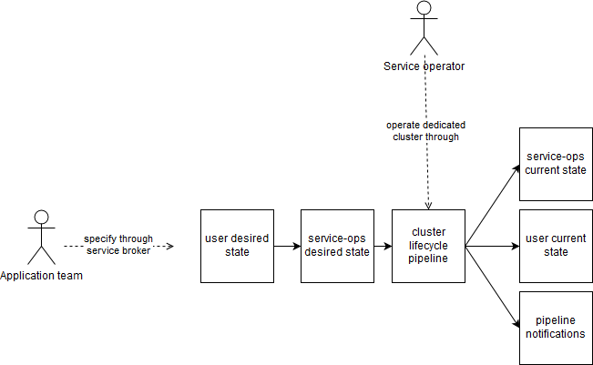

# Introduction

This page describes an experiment for producing on-demand dedicated services from existing mono tenant services.

# Why

Many available services don't have built-in multi-tenancy features required to share them among multiple independent consummers that would suffer from noisy neighbor effects.

This approach dynamically instanciates a dedicated mono-tenant service cluster on demand, and applies regular day 2 operations on it.

This approach tries to build upon existing automation for mono tenant services (bosh, terraform, CF), as well as existing operation tools (concourse, slack, prometheus, ...)

# How

A service broker which dynamically triggers the generation a new concourse pipeline for each dedicated cluster.

## User experience

### Non bindeable "cluster" service instances

Given a mono-tenant service such as 

```
$ cf marketplace

service                plans                      description
mysql        100mb, 1gb, 15gb                 MySQL databases on demand in a shared cluster
```

The service catalog gets enriched with a set of cluster non-bindeable plans

```
$ cf marketplace
service                plans                                               description
mysql-on-demand        cluster-small, cluster-large, 100mb, 1gb, 15gb      MySQL clusters and databases on demand
```

A team instanciates a dedicated cluster within a space:

```
#USAGE:
#   cf create-service SERVICE PLAN SERVICE_INSTANCE [-c PARAMETERS_AS_JSON] [-t TAGS]

$ cf create-service mysql-on-demand cluster-small my-team-db-cluster
(non-bindeable)

$ cf services 
Getting services in org my-team / space prod as gberche...
OK

name                         service             plan        bound apps                       last operation
my-team-db-cluster   mysql-on-demand     cluster-small                                           success
```

It then instanciates databases within this cluster, by referencing it as arbitrary params

```
$ cf create-service mysql-on-demand database my-team-customer-db -c { "cluster"="my-team-db-cluster"}
$ cf create-service mysql-on-demand database my-team-product-db  -c { "cluster"="my-team-db-cluster"}

$ cf bind-service my-team-product-db my-team-product-app
$ cf bind-service my-team-customer-db my-team-customer-app

$ cf services 
Getting services in org system_domain / space etherpad as gberche...
OK

name                         service             plan        bound apps                   last operation
my-team-db-cluster   mysql-on-demand     cluster-small                                       success
my-team-customer-db  mysql-on-demand     15gb            my-team-customer-app                success
my-team-product-db   mysql-on-demand     15gb            my-team-product-app                 success
```

The dedicated cluster can be updated, this applies to all databases 

```
USAGE:
   cf update-service SERVICE_INSTANCE [-p NEW_PLAN] [-c PARAMETERS_AS_JSON] [-t TAGS]

#Scale up
$ cf update-service my-team-db-cluster -p cluster-large 

# Tune cluster config, applies
$ cf update-service my-team-db-cluster -c { cf_mysql.mysql.innodb_buffer_pool_instances=2GB }
```

The dedicated cluster can not be deleted until all database service instances get deleted.

```
$ cf delete-service my-team-db-cluster
ERROR 400: can not delete cluster service instance with child service instances (guid=guid1, guid=guid2). Use dashboard to list all child service instance details.
``` 

A further refinement could enable to sharing clusters among spaces/orgs

```
$ cf create-service mysql-on-demand database my-team-customer-db -c { "cluster"="my-team-db-cluster" "cluster-org"="my-org" cluster-space="my-space"}
ERROR: 400, requesting user (userGuid=XX) has not permission to access cluster service-instance guid=YY
```

### Dedicated clusters appearing as distinct services in marketplace

In this simpler variation, the marketplace has a service for instanciation clusters on demand

```
$ cf marketplace
service                              plans                                               description
mysql-clusters-on-demand        cluster-small, cluster-large                 MySQL clusters and databases on demand
```

A team instanciates a dedicated cluster within a space:

```
#USAGE:
#   cf create-service SERVICE PLAN SERVICE_INSTANCE [-c PARAMETERS_AS_JSON] [-t TAGS]

$ cf create-service mysql-clusters-on-demand cluster-small my-team-db-cluster
(non-bindeable)

$ cf services 
Getting services in org my-team / space prod as gberche...
OK

name                         service             plan        bound apps                       last operation
my-team-db-cluster   mysql-on-demand     cluster-small                                           success
```

As a result, this register a new service offer in the organization

```
$ cf marketplace
service                              plans                                               description
mysql-clusters-on-demand        cluster-small, cluster-large                 MySQL clusters on demand
my-team-db-cluster              100mb, 1gb, 15gb                             MySQL databases on demand in the dedicated "my-team-db-cluster" shared cluster
```

Teams can then instanciate databases within this dedicated cluster, by referencing the associated service in marketplace

```
$ cf create-service my-team-db-cluster 15gb my-team-customer-db -c { "cluster"="my-team-db-cluster"}
$ cf create-service my-team-db-cluster 15gb my-team-product-db  -c { "cluster"="my-team-db-cluster"}

$ cf bind-service my-team-product-db my-team-product-app
$ cf bind-service my-team-customer-db my-team-customer-app

$ cf services 
Getting services in org system_domain / space etherpad as gberche...
OK

name                         service             plan        bound apps                   last operation
my-team-db-cluster   mysql-on-demand     cluster-small                                       success
my-team-customer-db  my-team-db-cluster  15gb           my-team-customer-app                success
my-team-product-db   my-team-db-cluster  15gb           my-team-product-app                 success
```

### Dedicated clusters with single database

In this variation, a dedicated cluster only supports a single database which may be bound by different applications using different credentials

The marketplace has a service for instanciation clusters on demand

```
$ cf marketplace
service                              plans                                               description
mysql-clusters-on-demand        cluster-small, cluster-large                 MySQL clusters and databases on demand
```

A team instanciates a dedicated cluster within a space, and a single database within it:

```
#USAGE:
#   cf create-service SERVICE PLAN SERVICE_INSTANCE [-c PARAMETERS_AS_JSON] [-t TAGS]

$ cf create-service mysql-clusters-on-demand cluster-small my-team-db-cluster

$ cf services 
Getting services in org my-team / space prod as gberche...
OK

name                         service             plan        bound apps                       last operation
my-team-db-cluster   mysql-on-demand     cluster-small                                           success
```

Teams can bind one or multiple application to this database

```
$ cf bind-service my-team-product-db my-team-product-app
$ cf bind-service my-team-customer-db my-team-customer-app

$ cf services 
Getting services in org system_domain / space etherpad as gberche...
OK

name                         service             plan        bound apps                              last operation
my-team-db-cluster   mysql-on-demand     cluster-small  my-team-customer-app, my-team-product-app       success
```

In the same space, or in the future in different spaces following the [Service instance sharing proposal](http://cf-dev.70369.x6.nabble.com/cf-dev-Proposal-Sharing-service-instances-across-orgs-and-spaces-td7076.html)

### Comparisons

* Non bindeable "cluster" service instances
  * `-:` More complex UX that need to reference clusters as arbitrary param: 
* Dedicated clusters appearing as distinct services in marketplace
  * `+:` Less work for the on-demand broker: no need to track database instanciation to reject cluster deletion requests (handled by CC)
  * `-:` Pollutes the marketplace  
* Dedicated clusters with single database
  * `-:` No way to share cluster among multiple dbs
  * `-:` sharing cluster across spaces depends on [Service instance sharing proposal](http://cf-dev.70369.x6.nabble.com/cf-dev-Proposal-Sharing-service-instances-across-orgs-and-spaces-td7076.html)

## Overall picture



User desired state is composed of parameters passed to the service broker API, typically:
- instance guid
- plan (usually cluster sizing)
- arbitrary params such as 
   - cluster-wide configurations (e.g. cache size)
   - major version
- org/space (used for billing)
- requester userId 


Service-ops desired state typically contains:
- terraform config (iaas or cloudfoundry), 
- new bosh deployments
- bosh errand execution
- updates to shared bosh deployments
- new cloudfoundry app deployments
- API calls to register to other systems

Cluster life cycle pipeline include the following tasks (triggered by dependent resources or explicit ops request)
- deploy
- recreate: recreate resources, usually preserving its state (e.g. bosh recreate)
- delete

Service ops current state contains:
- cluster credentials (e.g. hosted in credhub)
- deployed state (e.g. in bo


Specifically for mysql, Service-ops desired state contains:
- ~openstack service groups for server affinity~
- mysql-release bosh deployment including mysql-nodes, proxy, arbitrator instance groups. This includes prometheus node+mysql exporters jobs collocated.
- mysql-release errands: boostrap, smoke tests
- update to shared bosh deployments: 
   - prometheus exporter registration (until autodiscovery gets automated)
   - shield backup registration
- New CF apps, e.g. dedicated phpmyadmin app instances, dedicated probe apps


# What
